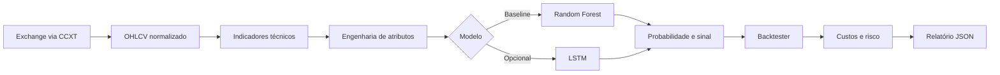

<div align="center">

# AI Trading Bot

### Laboratório reproduzível de machine learning aplicado a séries temporais financeiras

[](https://github.com/TheoGoulart333/AI-Trading-Bot/actions/workflows/ci.yml)
[](https://www.python.org/)
[](https://scikit-learn.org/)
[](https://github.com/ccxt/ccxt)
[](LICENSE)

Um pipeline educacional que conecta dados OHLCV, indicadores técnicos, modelos
temporais e backtesting com custos de execução e gestão de risco.

[Visão geral](#visão-geral) · [Arquitetura](#arquitetura) · [Como executar](#como-executar) · [Validação](#validação) · [Interpretação](#interpretação-responsável)

</div>

> [!IMPORTANT]
> Este repositório é um experimento de engenharia e pesquisa. Ele não executa
> ordens reais, não constitui recomendação financeira e não garante retorno.

## Visão geral

O projeto investiga uma pergunta objetiva: **como estruturar e avaliar um
baseline de classificação direcional sem confundir desempenho histórico com
capacidade preditiva real?**

O fluxo implementado:

1. coleta candles por meio da API unificada da CCXT;
2. constrói indicadores e atributos sem usar informações futuras;
3. separa treino e teste respeitando a ordem cronológica;
4. estima a probabilidade de alta do próximo candle;
5. converte previsões em operações simuladas;
6. mede retorno, drawdown, taxa de acerto e profit factor;
7. salva modelo e relatório para auditoria.

O `RandomForestClassifier` funciona como baseline principal. Uma implementação
LSTM opcional permite explorar sequências, mantendo o ajuste do scaler restrito
ao conjunto de treino.

## O que este projeto demonstra

- **Engenharia de atributos temporal:** retornos, volume relativo, momentum,
  tendência e volatilidade.
- **Prevenção de look-ahead bias:** o último candle, cujo futuro é desconhecido,
  não recebe artificialmente a classe de baixa.
- **Alinhamento por timestamp:** candles, atributos, targets e previsões usam o
  mesmo índice temporal durante o backtest.
- **Validação cronológica:** split de treino/teste e `TimeSeriesSplit`, nunca
  embaralhamento aleatório.
- **Execução mais realista:** slippage adverso, taxa na entrada e na saída,
  stop-loss, take-profit e encerramento por sinal contrário.
- **Métricas sem falsa precisão:** o Sharpe é informado por operação e não é
  anualizado quando a frequência efetiva da estratégia é desconhecida.
- **Resiliência da coleta:** falhas transitórias de rede usam tentativas com
  espera exponencial; erros da exchange falham imediatamente.
- **Qualidade automatizada:** formatação, lint, testes e cobertura executados no
  GitHub Actions.

## Arquitetura



| Módulo | Responsabilidade |
| --- | --- |
| `src/data_ingestion.py` | Conexão CCXT, normalização OHLCV, rate limit e retries |
| `src/technical_analysis.py` | SMA, EMA, RSI, MACD, Bollinger Bands, ATR e VWAP |
| `src/ai_model.py` | Preparação temporal, Random Forest, LSTM e persistência |
| `src/backtesting.py` | Simulação de posições, custos, risco e métricas |
| `main.py` | Orquestração do pipeline e interface de linha de comando |
| `tests/` | Testes unitários de indicadores, modelos, coleta e backtest |

## Como executar

### 1. Preparar o ambiente

```bash
git clone https://github.com/TheoGoulart333/AI-Trading-Bot.git
cd AI-Trading-Bot
python -m venv .venv
source .venv/bin/activate
python -m pip install --upgrade pip
python -m pip install -r requirements.txt
```

No Windows, ative o ambiente com `.venv\Scripts\activate`.

### 2. Rodar sem API externa

```bash
python main.py --dry-run --limit 500
```

Esse modo cria uma série sintética reproduzível e valida todas as etapas sem
depender de uma exchange.

### 3. Usar dados públicos de mercado

```bash
python main.py --symbol BTC/USDT --timeframe 1h --limit 1000
```

Os dados são usados somente para pesquisa e backtesting. O projeto não envia
ordens nem solicita chaves privadas.

### 4. Experimentar a LSTM

```bash
python -m pip install -r requirements-lstm.txt
python main.py --model lstm --dry-run --limit 2000
```

## Parâmetros

| Opção | Padrão | Descrição |
| --- | --- | --- |
| `--symbol` | `BTC/USDT` | Mercado analisado |
| `--timeframe` | `1h` | Intervalo dos candles |
| `--limit` | `500` | Quantidade de candles solicitada |
| `--model` | `random_forest` | `random_forest` ou `lstm` |
| `--dry-run` | desativado | Usa dados sintéticos reproduzíveis |
| `--output` | `results` | Diretório de artefatos |
| `--log-level` | `INFO` | Nível de detalhamento do log |

## Validação

Instale as dependências de desenvolvimento e rode a mesma verificação usada no
CI:

```bash
python -m pip install -r requirements-dev.txt
python -m black --check main.py src tests
python -m ruff check main.py src tests
python -m pytest --cov=src --cov-report=term-missing --cov-fail-under=75
```

A suíte verifica, entre outros comportamentos:

- invariantes matemáticos dos indicadores;
- exclusão do target sem futuro conhecido;
- preservação dos timestamps das amostras;
- treino, inferência e restauração do Random Forest;
- sequências da LSTM sem ajuste antecipado do scaler;
- confiança correta para sinais de alta e de baixa;
- taxas de ida e volta e encerramento por sinal;
- stop-loss e validação das entradas do backtest;
- repetição apenas para falhas recuperáveis de rede.

## Interpretação responsável

O modo `--dry-run` é um teste de integração, não um benchmark financeiro. Uma
acurácia baixa ou um retorno negativo em dados sintéticos é um resultado válido:
ele mostra que o pipeline não foi construído para fabricar uma narrativa de
lucro.

Antes de qualquer estudo mais sério, seria necessário acrescentar:

- walk-forward validation com múltiplas janelas;
- comparação contra buy-and-hold e classificadores ingênuos;
- calibração de probabilidades e análise de estabilidade;
- custos específicos de mercado, liquidez e latência;
- prevenção de survivorship bias e seleção retrospectiva;
- testes fora da amostra em diferentes regimes de mercado.

## Estrutura

```text
AI-Trading-Bot/
├── .github/workflows/ci.yml
├── src/
│   ├── ai_model.py
│   ├── backtesting.py
│   ├── data_ingestion.py
│   └── technical_analysis.py
├── tests/
│   ├── conftest.py
│   ├── test_ai_model.py
│   ├── test_backtesting.py
│   ├── test_data_ingestion.py
│   └── test_technical_analysis.py
├── main.py
├── pyproject.toml
├── requirements.txt
├── requirements-dev.txt
└── requirements-lstm.txt
```

## Próximos experimentos

- adicionar baselines determinísticos para comparação;
- implementar walk-forward validation;
- produzir curva de patrimônio e relatório HTML;
- testar calibração e seleção de limiar por janela de validação;
- tornar configurações da estratégia externas e versionáveis.

## Licença

Distribuído sob a licença [MIT](LICENSE).

---

<div align="center">

Construído por [Theo Goulart](https://github.com/TheoGoulart333) como estudo de
IA aplicada, engenharia de software e avaliação responsável de modelos.

</div>
